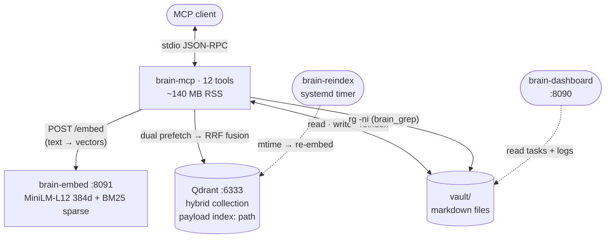

# Brain MCP

MCP server for hybrid retrieval over a markdown vault: dense embeddings plus BM25, fused with RRF. Writes reindex the changed file. Optional shared embed process so each MCP session does not load models.

Compatible with any [MCP](https://modelcontextprotocol.io) stdio client.

## Requirements

| | |
|--|--|
| Python | 3.11+ |
| Docker Compose | v2 (Qdrant + embed service) |
| [ripgrep](https://github.com/BurntSushi/ripgrep) | `rg` on `PATH` |
| RAM | ~1.2 GB for ONNX models |

## Install

```bash
git clone https://github.com/Artur0927/brain-mcp.git
cd brain-mcp
bash scripts/deploy.sh
```

`deploy.sh` creates a venv, copies `examples/sample-vault` to `./vault` if missing, starts Qdrant and the embed service, runs `brain-index`, and writes `examples/mcp/mcp.generated.json`.

First run downloads embedding models (~400 MB). Merge the generated `mcpServers` block into your MCP client config (see [docs/setup.md](docs/setup.md)).

Existing vault:

```bash
bash scripts/deploy.sh --vault /path/to/markdown
```

## Architecture



**Search flow:** query → `brain-embed` encodes dense (384d cosine) + sparse (BM25 IDF) → Qdrant runs two prefetches (3x limit each) → RRF fusion → ranked chunks returned.

**Write flow:** file written to vault → chunked on headings (max 1500 chars) → old chunks deleted from Qdrant → new chunks embedded and upserted.

| Process | Role | Bind |
|---------|------|------|
| `brain-mcp` | MCP tools, vault I/O, Qdrant queries | stdio |
| `brain-embed` | Dense + sparse ONNX models, loaded once | `127.0.0.1:8091` |
| Qdrant | Hybrid vector collection | `127.0.0.1:6333` |
| `vault/` | Markdown source of truth | filesystem |
| `brain-reindex` | Incremental mtime-based reindex | systemd timer |
| `brain-dashboard` | Read-only Kanban + session logs | `127.0.0.1:8090` |

Details: [docs/architecture.md](docs/architecture.md)

## Tools

| Tool | Behavior |
|------|----------|
| `brain_search` | Dense + sparse prefetch, RRF fusion; optional `path_prefix` |
| `brain_grep` | `rg` over the vault |
| `brain_read` | Read file by relative path |
| `brain_batch_read` | Up to 5 files per call |
| `brain_list` | Depth-limited listing |
| `brain_stats` | Collection size, disk, embed health, `.md` count |
| `brain_write` / `brain_append` | Mutate file, then reindex |
| `brain_log` | Append to `YYYY-MM-DD.md` |
| `brain_lesson` | Write `knowledge/agent-lessons/<stamp>_<agent>_<category>.md` |
| `brain_task_claim` / `brain_task_release` | File locks under `tasks/.locks/` |

## Server install

```bash
sudo bash scripts/deploy.sh --server --vault /data/vault
```

Installs under `/opt/brain-mcp`, enables `brain-reindex.timer` and `brain-dashboard`. Remote MCP over SSH: `scripts/mcp-launcher.sh` (ControlMaster). Config: [docs/setup.md](docs/setup.md), [.env.example](.env.example).

## Configuration

| Variable | Default |
|----------|---------|
| `BRAIN_VAULT` | `./vault` |
| `BRAIN_COLLECTION` | `brain` |
| `BRAIN_QDRANT_HOST` / `BRAIN_QDRANT_PORT` | `127.0.0.1` / `6333` |
| `BRAIN_EMBED_URL` | `http://127.0.0.1:8091/embed` |
| `BRAIN_DASHBOARD_PORT` | `8090` |
| `BRAIN_AGENT_LOGS` | `./agentlogs` |

## CLI

```
brain-mcp             stdio MCP server
brain-embed           embedding HTTP service
brain-index           full reindex (recreates collection)
brain-reindex         mtime incremental reindex
brain-lessons-index   rebuild knowledge/agent-lessons/INDEX.md
brain-dashboard       HTTP UI
```

## Operations

| Symptom | Check |
|---------|--------|
| Tools missing in client | Reload MCP server; confirm `command` path in config |
| `embed_service: DOWN` | `docker compose ps`; `curl -s http://127.0.0.1:8091/` |
| Empty search | `brain-index`; `brain-stats` |
| `rg: command not found` | install ripgrep |
| Slow first start | model download |
| Port 8091 in use | `docker compose down` or `BRAIN_EMBED_PORT` |

## Layout

```
src/brain_mcp/        server, embed, indexer, dashboard
scripts/deploy.sh     local and --server install
examples/sample-vault template vault
examples/mcp/         mcp.json template
deploy/systemd/       units
docs/                 architecture, setup, agent protocol
docker-compose.yml    qdrant + embed
```

Agent boot/report convention: [docs/agent-workflow.md](docs/agent-workflow.md).

## Development

```bash
python3 -m venv .venv
source .venv/bin/activate
pip install -e .
```

## License

[MIT](LICENSE)
