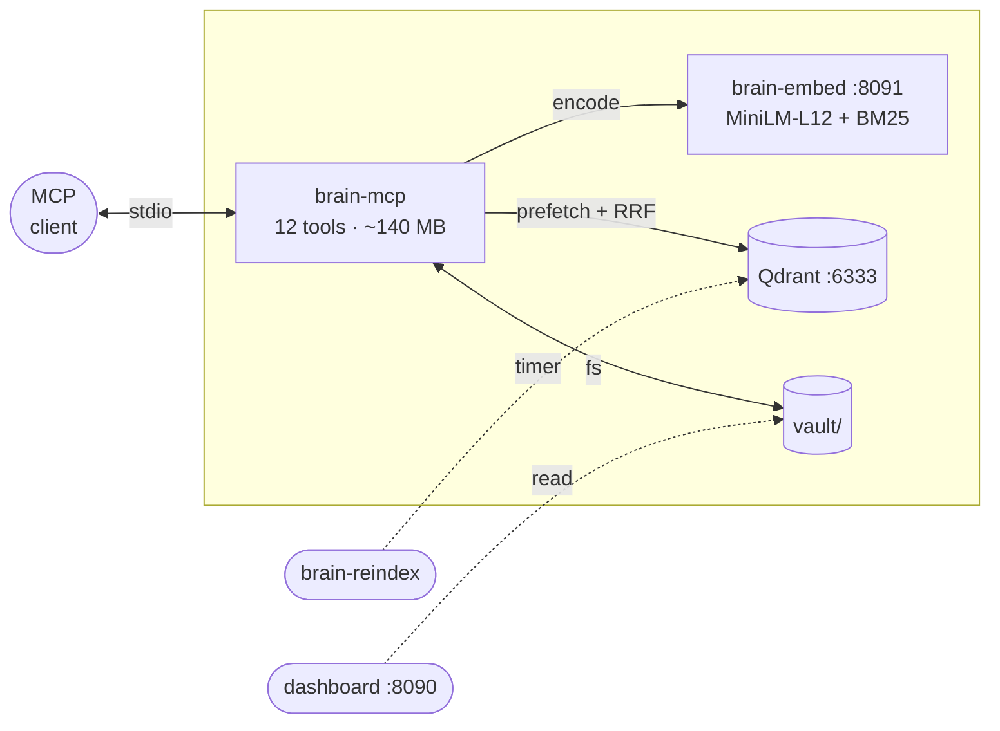
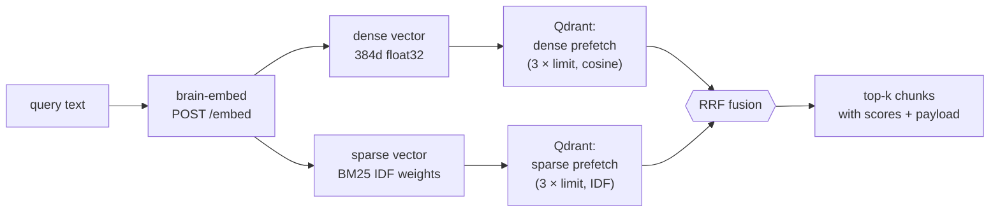
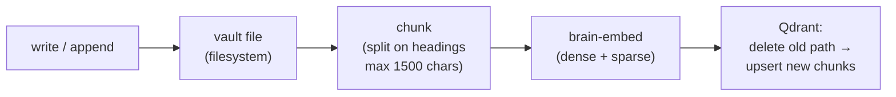

# Architecture

Brain MCP is an MCP stdio server over a markdown vault. Retrieval is hybrid (dense MiniLM + BM25 sparse, RRF). Mutations reindex the affected file.

## System overview

## Search pipeline

`brain_search` is the primary retrieval tool. It runs two parallel vector searches and merges results.

1. Query text is sent to `brain-embed` which returns both dense (MiniLM-L12, 384 dimensions, cosine) and sparse (BM25 with IDF modifier) vectors.
2. Qdrant runs two prefetches: dense retrieves by semantic similarity, sparse by keyword overlap. Each returns `3 × limit` candidates.
3. Reciprocal Rank Fusion merges both ranked lists into a single result set.
4. Optional `path_prefix` applies a `MatchText` filter on the `path` payload field before fusion.

`brain_grep` bypasses vectors entirely — it runs `rg -n --max-count 3 -i` directly on vault files.

## Write pipeline

Any mutation tool (`brain_write`, `brain_append`, `brain_log`, `brain_lesson`) follows the same pattern:

1. File is written to the vault.
2. Content is split into chunks at markdown heading boundaries. Paragraphs break up blocks exceeding 1500 characters.
3. Old Qdrant points matching the file's relative `path` are deleted.
4. New chunks are embedded (dense + sparse) and upserted with payload: `{path, chunk, title, mtime, text}`.

## Thin client design

Each MCP session spawns a `brain-mcp` process. Loading ONNX embedding models in every process would cost ~600 MB RSS.

`brain-embed` is a standalone HTTP service that loads both models once and serves `POST /embed`. This keeps each MCP process at ~140 MB.

| Model | Kind | Dimensions |
|-------|------|------------|
| `sentence-transformers/paraphrase-multilingual-MiniLM-L12-v2` | dense | 384, cosine |
| `Qdrant/bm25` | sparse | variable, IDF modifier |

## Indexing

| Command | Behavior |
|---------|----------|
| `brain-index` | Drop + recreate collection, KEYWORD index on `path`, batch embed + upsert all `.md` files |
| `brain-reindex` | Compare file mtime against marker, re-embed only changed files |
| write tools | Per-file: delete old points by `path`, chunk, embed, upsert |

## Qdrant collection

- **Dense named vector** `"dense"`: 384d, cosine distance
- **Sparse named vector** `"sparse"`: variable-length, IDF modifier
- **Payload index**: KEYWORD on `path` field (speeds up deletes and `path_prefix` filtering)
- Point ID: deterministic `uuid5(namespace, "{path}:{chunk_index}")`

## Dashboard

`brain-dashboard` is an optional stdlib HTTP server that reads:
- `tasks/{backlog,active,blocked,done}/*.md` for the Kanban view
- `BRAIN_AGENT_LOGS/{date}/*.jsonl` for changes, errors, and session views

No writes. No authentication (bind to `127.0.0.1` by default).

## Deployment modes

**Local:** MCP process + vault on the workstation. Qdrant and embed via Docker Compose.

**Remote:** MCP over SSH stdio. `scripts/mcp-launcher.sh` uses `ControlMaster` / `ControlPersist` for connection reuse.

**Server:** `deploy.sh --server` installs to `/opt/brain-mcp`, creates systemd units for reindex timer and dashboard.

## Environment

| Variable | Default |
|----------|---------|
| `BRAIN_VAULT` | `./vault` |
| `BRAIN_COLLECTION` | `brain` |
| `BRAIN_QDRANT_HOST` | `127.0.0.1` |
| `BRAIN_QDRANT_PORT` | `6333` |
| `BRAIN_EMBED_URL` | `http://127.0.0.1:8091/embed` |
| `BRAIN_EMBED_PORT` | `8091` |
| `BRAIN_DASHBOARD_PORT` | `8090` |
| `BRAIN_AGENT_LOGS` | `./agentlogs` |

Python 3.11+, `rg`, Qdrant, ~1.2 GB RAM for models.
