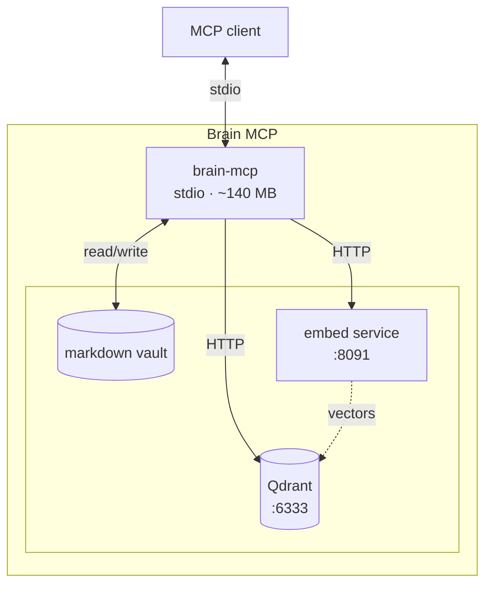

# Architecture

Brain MCP is an MCP stdio server over a markdown vault. Retrieval is hybrid (dense MiniLM + BM25 sparse, RRF). Mutations reindex the affected file.

## Processes

## Thin client

Each MCP connection is a process. Loading FastEmbed in every session is ~600 MB RSS.

`brain-embed` loads dense and sparse models once and serves `POST /embed`. The MCP process stays ~140 MB.

| Model | Kind | Dim / type |
|-------|------|------------|
| `sentence-transformers/paraphrase-multilingual-MiniLM-L12-v2` | dense | 384, cosine |
| `Qdrant/bm25` | sparse | IDF modifier |

## Search

`brain_search` issues two Qdrant prefetches (dense, sparse), then `Fusion.RRF`. Optional `path_prefix` uses `MatchText` on payload `path`.

`brain_grep` is `rg -n --max-count 3 -i` over the vault.

## Indexing

- `brain-index` — `recreate_collection`, KEYWORD index on `path`, batch upsert
- `brain-reindex` — files with mtime newer than marker
- write tools — delete by `path` then upsert chunks

Chunking: split on markdown headings, max 1500 characters, then paragraphs.

## Tools (12)

Same set as README. Dashboard is not an MCP tool.

## Dashboard

`brain-dashboard` binds `BRAIN_DASHBOARD_HOST:BRAIN_DASHBOARD_PORT` (default `127.0.0.1:8090`). Reads `tasks/{backlog,active,blocked,done}` and JSONL under `BRAIN_AGENT_LOGS`.

## Deploy

Local: MCP + vault on the workstation; Qdrant and embed via Compose.

Remote: MCP over SSH stdio (`scripts/mcp-launcher.sh`).

## Environment

| Variable | Default |
|----------|---------|
| `BRAIN_VAULT` | `./vault` |
| `BRAIN_COLLECTION` | `brain` |
| `BRAIN_QDRANT_HOST` | `127.0.0.1` |
| `BRAIN_QDRANT_PORT` | `6333` |
| `BRAIN_EMBED_URL` | `http://127.0.0.1:8091/embed` |
| `BRAIN_EMBED_PORT` | `8091` |
| `BRAIN_DASHBOARD_PORT` | `8090` |
| `BRAIN_AGENT_LOGS` | `./agentlogs` |

Python 3.11+, `rg`, Qdrant, ~1.2 GB RAM for models.
